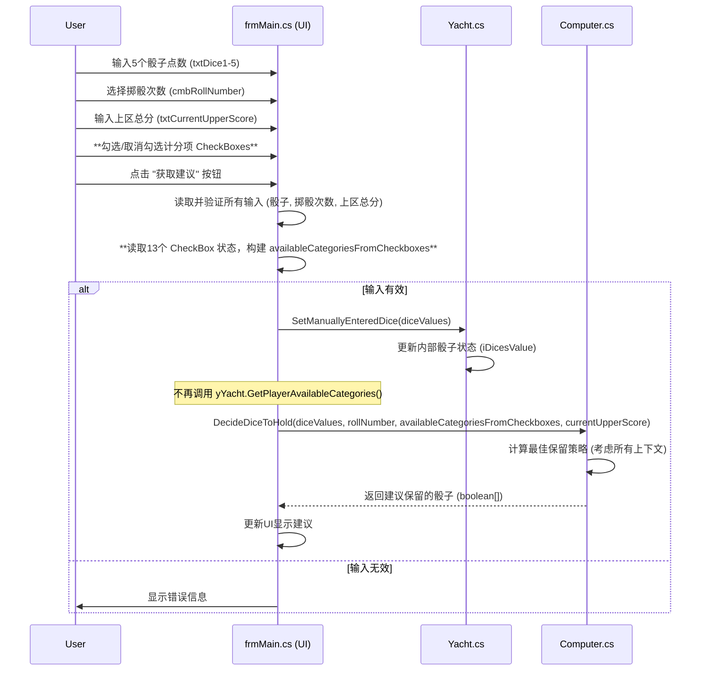

# Yacht 游戏模拟器软件架构

**日期:** 2025-05-18 (更新于: 2025-05-18 23:22:00)

## 1. 架构概述

Yacht 游戏模拟器采用以 Windows Forms 为中心的事件驱动架构。其核心模拟流程，经过最近的细化，允许用户通过 "手动单步模拟" 按钮点击，手动逐步执行计算机玩家回合中的每一个具体步骤。此外，还新增了允许用户手动输入5个骰子点数、**指定当前掷骰次数、当前上区总分以及通过界面上的13个复选框精确控制在请求AI保留骰子建议时哪些Yacht计分类别是可用的**，并获取AI基于此完整上下文的保留建议的功能。虽然没有严格的分层，但可以观察到以下概念层：

*   **表示层 (Presentation Layer):** 由 [`ComputerYacht/frmMain.cs`](ComputerYacht/frmMain.cs:0) 处理，负责用户界面、事件处理（如按钮点击）以及统计数据的显示。
*   **应用逻辑/领域层 (Application Logic/Domain Layer):**
    *   [`ComputerYacht/Yacht.cs`](ComputerYacht/Yacht.cs:0): 实现核心的 Yacht 游戏规则，包括掷骰子、计分、回合管理等。
    *   [`ComputerYacht/Computer.cs`](ComputerYacht/Computer.cs:0): 包含复杂的计算机 AI 策略，用于决定保留哪些骰子以及选择最佳的计分组合。**AI现在能够利用掷骰次数和当前上区总分进行更智能的决策。**
*   **实用/辅助层 (Utility/Helper Layer):**
    *   [`ComputerYacht/Dice.cs`](ComputerYacht/Dice.cs:0): 提供骰子点数出现概率的精确计算。

该架构的核心是一个模拟引擎，允许用户通过 "手动单步模拟" 按钮，细致地观察并控制AI玩家在游戏每一回合中各个决策阶段的逐步进展，并且也支持直接输入骰子及相关游戏状态（掷骰次数、上区得分）获取AI的即时保留建议。

## 2. 主要功能实现及模块交互

以下是主要功能在架构中的实现方式以及模块间的交互：

### 2.1. 游戏引擎与规则 (`Yacht.cs`)

*   **功能:**
    *   管理游戏状态（当前玩家、掷骰子次数、分数）。
    *   实现标准的 5 骰子掷骰机制。
    *   管理 13 个标准计分类型。
    *   计算上半区奖励和多次 Yachtzee 奖励。
    *   提供细粒度的方法来支持分步执行：`PerformRoll`, `ApplyHoldDecision`, `ApplyScoreAndFinalizeTurn`。
    *   提供访问器方法：`GetCurrentDiceValues`, `GetCurrentHeldDice`, `GetRollAttemptInTurn`, `GetPlayerAvailableCategories`, `IsGameOver` 等。
    *   `SetManuallyEnteredDice(diceValues AS INTEGER[5])`: 允许外部直接设置骰子的当前值。
*   **交互:**
    *   与 [`ComputerYacht/frmMain.cs`](ComputerYacht/frmMain.cs:0) 紧密交互。
    *   向 `frmMain.cs` 提供当前游戏状态。
    *   AI决策的调用由 `frmMain.cs` 协调。
    *   对于手动输入骰子功能，`frmMain.cs` 会调用 `SetManuallyEnteredDice()`。

### 2.2. 计算机 AI 玩家 (`Computer.cs`)

*   **功能:**
    *   提供细粒度的决策方法，由 [`ComputerYacht/frmMain.cs`](ComputerYacht/frmMain.cs:0) 在适当的回合步骤中调用：
        *   `DecideDiceToHold(currentDiceValues[5] AS INTEGER, rollNumber AS INTEGER, availableCategories AS BOOLEAN[], currentUpperScore AS INTEGER) AS BOOLEAN[5]`: 根据当前骰子、掷骰次数、可用计分项和当前上区总分，决定要保留的骰子。
        *   `ChooseScoreCategory(finalDiceValues[5] AS INTEGER, availableCategories AS BOOLEAN[]) AS ScoringDecision`: 在最终掷骰后，根据可用计分项选择最佳计分类型和计算得分。
    *   利用详细的内部游戏状态表示和计分机会。
    *   使用预定义的权重和概率计算。
    *   实现必要时牺牲低价值计分类型的策略。
*   **交互:**
    *   其决策方法由 [`ComputerYacht/frmMain.cs`](ComputerYacht/frmMain.cs:0) 调用。
    *   大量使用 [`ComputerYacht/Dice.cs`](ComputerYacht/Dice.cs:0) 来计算概率。
    *   其决策结果返回给 [`ComputerYacht/frmMain.cs`](ComputerYacht/frmMain.cs:0)。
    *   在手动输入骰子功能中，`DecideDiceToHold()` 方法会接收由用户通过UI输入并由 `frmMain.cs` 传递过来的骰子值、掷骰次数、可用计分项和上区总分。

### 2.3. 模拟与统计 (`frmMain.cs`)

*   **功能:**
    *   管理手动单步模拟的状态机。
    *   响应 "手动单步模拟" 按钮点击。
    *   UI 更新。
    *   管理游戏开始、回合结束和游戏结束的转换。
    *   记录和显示统计数据。
    *   **新增手动骰子输入与建议功能 (增强版):**
        *   提供5个文本输入框 (`txtDice1` - `txtDice5`) 供用户输入1-6之间的骰子点数。
        *   **新增一个组合框或数字选择器 (`cmbRollNumber`) 供用户选择当前是第几次掷骰 (1, 2, 或 3)。**
        *   **新增一个文本输入框 (`txtCurrentUpperScore`) 供用户输入当前的上区总分。**
        *   提供一个“获取建议”按钮 (`btnGetHoldSuggestion`)。
        *   **`btnGetHoldSuggestion_Click` 事件处理程序已被重构为多个更小的辅助方法，以提高代码的可读性和可维护性。**
        *   当按钮点击时，重构后的逻辑会读取输入框中的骰子点数、选择的掷骰次数和上区总分，并进行验证。
        *   调用 `yYacht.SetManuallyEnteredDice()` 将验证后的骰子值传递给 `Yacht` 对象。
        *   **界面上新增一个 `GroupBox` 控件，内含13个 `CheckBox` 控件，每个对应一个Yacht计分项，允许用户手动选择哪些计分项对AI在提供保留建议时可用。**
        *   **重构后的 `btnGetHoldSuggestion_Click` 相关逻辑将读取这些 `CheckBox` 的状态，构建一个布尔数组 `availableCategoriesFromCheckboxes`。**
        *   **在此流程中，不再调用 `yYacht.GetPlayerAvailableCategories(0)` 来获取可用计分项。**
        *   调用 `compPlayer.DecideDiceToHold(currentDiceValues, rollNumber, availableCategoriesFromCheckboxes, currentUpperScore)`，传递所有收集到的上下文信息。
        *   接收 `Computer.cs` 返回的建议保留的骰子 (boolean array)。
        *   在UI上高亮或标记建议保留的骰子。
*   **交互:**
    *   实例化并管理 [`ComputerYacht/Yacht.cs`](ComputerYacht/Yacht.cs:0) 和 [`ComputerYacht/Computer.cs`](ComputerYacht/Computer.cs:0) 对象。
    *   响应用户UI操作。
    *   协调对其他模块方法的调用。
    *   对于手动输入骰子功能，会调用 `yYacht.SetManuallyEnteredDice()` 和 `compPlayer.DecideDiceToHold()` 并传递更丰富的上下文，**其中 `availableCategories` 来自UI上的CheckBoxes**。
    *   直接进行文件 I/O 以记录游戏数据。

### 2.4. 骰子概率计算 (`Dice.cs`)
*   **功能:**
    *   提供一个静态方法 (`CalculateExactChance`)，通过穷举所有可能的骰子结果来计算获得特定骰子组合（例如，三条、四条、顺子）的确切概率。
*   **交互:**
    *   主要由 [`ComputerYacht/Computer.cs`](ComputerYacht/Computer.cs:0) 调用，为其决策过程提供关键的概率数据。

## 3. 数据流和控制流 (手动单步回合内模拟)

1.  **初始化/新游戏:**
    a.  [`ComputerYacht/frmMain.cs`](ComputerYacht/frmMain.cs:0) 实例化 `Yacht` 和 `Computer` 对象。
    b.  调用 `yYacht.ResetYacht()`。
    c.  `frmMain.cs` 设置其内部状态 `currentPhase` 为 `READY_FOR_ROLL_1`。
    d.  UI 更新以显示初始状态和提示信息 ("点击按钮进行第一次掷骰")。

2.  **用户点击 "手动单步模拟" 按钮:** [`ComputerYacht/frmMain.cs`](ComputerYacht/frmMain.cs:0) 的 `btnManualStep_Click` 事件触发。
    *   **IF `currentPhase` is `READY_FOR_ROLL_1` (第一次掷骰):**
        i.  `frmMain.cs` 调用 `yYacht.PerformRoll(1)`。
        ii. `yYacht` 掷所有5个骰子，更新其内部 `iDicesValue`，`iRollIndex` 设为0。返回骰子值。
        iii. `frmMain.cs` 接收骰子值，更新UI显示骰子。
        iv. `frmMain.cs` 将 `currentPhase` 更新为 `AWAITING_HOLD_DECISION_1`。
        v.  `frmMain.cs` 自动调用 `compPlayer.ComputerDecideDiceToHold(yYacht.GetCurrentDiceValues(), 1)`。
        vi. `compPlayer` 返回建议保留的骰子 (boolean array)。
        vii. `frmMain.cs` 调用 `yYacht.ApplyHoldDecision(heldDiceFromAI)`。
        viii. `yYacht` 更新其内部 `bDicesHold`。
        ix. `frmMain.cs` 更新UI显示保留的骰子和提示信息 ("AI已决策，点击进行第二次掷骰")。
        x.  `frmMain.cs` 将 `currentPhase` 更新为 `READY_FOR_ROLL_2`。
    *   **IF `currentPhase` is `READY_FOR_ROLL_2` (第二次掷骰):**
        i.  `frmMain.cs` 调用 `yYacht.PerformRoll(2)`。
        ii. `yYacht` 根据 `bDicesHold` 掷未保留的骰子，更新 `iDicesValue`，`iRollIndex` 设为1。返回骰子值。
        iii. (类似步骤 iii-x 上述，但 `rollNumber` 为2, `currentPhase` 变为 `AWAITING_HOLD_DECISION_2` 然后 `READY_FOR_ROLL_3`)。
    *   **IF `currentPhase` is `READY_FOR_ROLL_3` (第三次掷骰):**
        i.  `frmMain.cs` 调用 `yYacht.PerformRoll(3)`。
        ii. `yYacht` 根据 `bDicesHold` 掷未保留的骰子，更新 `iDicesValue`，`iRollIndex` 设为2。返回骰子值。
        iii. `frmMain.cs` 更新UI显示骰子。
        iv. `frmMain.cs` 将 `currentPhase` 更新为 `AWAITING_SCORING_DECISION`。
        v.  `frmMain.cs` 自动调用 `compPlayer.ComputerSelectScoringCategory(yYacht.GetCurrentDiceValues(), yYacht.GetAvailableCategories())`。
        vi. `compPlayer` 返回 `ScoringDecision` (选择的计分项索引和分数)。
        vii. `frmMain.cs` 调用 `yYacht.ApplyScoreAndFinalizeTurn(decision.bestCategoryIndex, decision.scoreForCategory)`。
        viii. `yYacht` 更新分数、奖励、`bScoreRecorded`，`iCurrentTurnNumber` 增加，重置 `iRollIndex` 和 `bDicesHold`。返回游戏是否结束。
        ix. `frmMain.cs` 更新UI显示分数和提示信息 ("AI已计分...")。
        x.  IF 游戏结束 (`yYacht.IsGameOver()` is true):
            `frmMain.cs` 将 `currentPhase` 更新为 `GAME_OVER`。显示最终统计和消息 ("游戏结束，点击开始新游戏")。记录分数到文件。
        xi. ELSE (游戏未结束):
            `frmMain.cs` 将 `currentPhase` 更新为 `TURN_COMPLETED` (或直接到 `READY_FOR_ROLL_1` for next turn)。显示消息 ("回合结束，点击开始下一回合")。
    *   **IF `currentPhase` is `TURN_COMPLETED` (且游戏未结束):**
        i.  `frmMain.cs` 将 `currentPhase` 更新为 `READY_FOR_ROLL_1`。
        ii. UI 更新提示开始新回合。
    *   **IF `currentPhase` is `GAME_OVER`:**
        i.  `frmMain.cs` 调用 `InitializeNewGame()`，流程回到步骤1。

3.  **等待下一次用户点击 "手动单步模拟" 按钮。**

### 3.1. 数据流和控制流 (手动输入骰子获取AI建议 - 增强版)

1.  **用户操作:**
    a.  用户在UI ([`ComputerYacht/frmMain.cs`](ComputerYacht/frmMain.cs:0)) 提供的5个输入框中输入骰子点数。
    b.  **用户通过 `cmbRollNumber` 选择当前是第几次掷骰的结果。**
    c.  **用户在 `txtCurrentUpperScore` 输入当前的上区总分。**
    d.  **用户勾选或取消勾选代表各个计分项的 CheckBox 控件。**
    e.  用户点击“获取建议”按钮。
2.  **UI 处理 ([`ComputerYacht/frmMain.cs`](ComputerYacht/frmMain.cs:0)):**
    a.  `btnGetHoldSuggestion_Click` 事件处理器被触发。
    b.  读取5个骰子输入框的值、`cmbRollNumber` 的值 (`rollNumber`) 和 `txtCurrentUpperScore` 的值 (`currentUpperScore`)。
    c.  **读取13个 CheckBox 控件的状态，构建一个布尔数组 `availableCategoriesFromCheckboxes`，其中 `true` 表示对应的计分项被选中（可用），`false` 表示未选中（不可用）。**
    d.  验证骰子、掷骰次数和上区总分输入值的有效性。
    e.  如果验证失败，向用户显示错误提示。
    f.  如果验证成功：
        i.  将5个骰子点数（`diceValues`）传递给 `yYacht.SetManuallyEnteredDice(diceValues)`。
        ii. **不再调用 `yYacht.GetPlayerAvailableCategories(0)`。**
        iii. 调用 `compPlayer.DecideDiceToHold(diceValues, rollNumber, availableCategoriesFromCheckboxes, currentUpperScore)`。
3.  **游戏逻辑处理 ([`ComputerYacht/Yacht.cs`](ComputerYacht/Yacht.cs:0)):**
    a.  `SetManuallyEnteredDice(diceValues)` 方法被调用，更新内部骰子状态。
    b.  **`GetPlayerAvailableCategories(0)` 在此特定用户场景中不再被 `frmMain.cs` 调用。**
4.  **AI 决策请求 ([`ComputerYacht/frmMain.cs`](ComputerYacht/frmMain.cs:0)) 与计算 ([`ComputerYacht/Computer.cs`](ComputerYacht/Computer.cs:0)):**
    a.  `frmMain.cs` 调用 `compPlayer.DecideDiceToHold()` 并传递 `diceValues`, `rollNumber`, `availableCategoriesFromCheckboxes`, 和 `currentUpperScore`。
    b.  `Computer.cs` 的 `DecideDiceToHold()` 方法接收所有这些参数。
    c.  AI执行其决策逻辑，利用所有上下文信息计算出建议保留的骰子。
    d.  返回一个布尔数组 (`suggestedHoldDice`) 给 `frmMain.cs`。
5.  **UI 显示建议 ([`ComputerYacht/frmMain.cs`](ComputerYacht/frmMain.cs:0)):**
    a.  `frmMain.cs` 接收到 `suggestedHoldDice`。
    b.  更新UI，例如高亮显示建议保留的骰子。
6.  **流程结束，等待用户下一步操作。**

## 4. 架构模式和原则

根据 [`memory-bank/systemPatterns.md`](memory-bank/systemPatterns.md:0) 的分析（部分模式可能因移除计时器而减弱或改变）：

*   **事件驱动架构:** UI 事件（按钮点击）驱动应用流程。
*   **策略模式 (隐式):** [`ComputerYacht/Computer.cs`](ComputerYacht/Computer.cs:0) 封装了 AI 策略。
*   **状态模式 (显式/隐式):** [`ComputerYacht/Yacht.cs`](ComputerYacht/Yacht.cs:0) 隐式管理整体游戏状态。[`ComputerYacht/frmMain.cs`](ComputerYacht/frmMain.cs:0) 现在显式管理当前回合内具体步骤的状态 (`TurnStepPhase`)，其行为（调用的方法）根据此状态而改变。
*   **观察者模式 (手动):** [`ComputerYacht/frmMain.cs`](ComputerYacht/frmMain.cs:0) 手动观察 [`ComputerYacht/Yacht.cs`](ComputerYacht/Yacht.cs:0) 的状态并更新 UI。
*   **常量配置:** AI 行为在很大程度上由 [`ComputerYacht/Computer.cs`](ComputerYacht/Computer.cs:0) 中的静态常量数组驱动。
*   **实用工具类:** [`ComputerYacht/Dice.cs`](ComputerYacht/Dice.cs:0) 是一个提供特定功能的静态类。

## 5. 总结

Yacht 游戏模拟器的架构以功能为中心，模块化程度合理。[`ComputerYacht/frmMain.cs`](ComputerYacht/frmMain.cs:0) 作为表示层和精细控制中心，管理回合内步骤的状态机（用于逐步模拟）和处理用户直接输入（用于手动骰子建议，现在包含掷骰次数、上区得分 **以及通过界面上的13个复选框手动选择的可用计分项**），并协调对其他模块的调用。**`btnGetHoldSuggestion_Click` 方法已被重构以提高清晰度。**[`ComputerYacht/Yacht.cs`](ComputerYacht/Yacht.cs:0) 封装核心游戏规则和状态。[`ComputerYacht/Computer.cs`](ComputerYacht/Computer.cs:0) 实现AI决策逻辑，其 `DecideDiceToHold` 方法现在可以处理更丰富的游戏上下文（包括掷骰次数、上区得分和用户指定的可用计分项）来进行决策。[`ComputerYacht/Dice.cs`](ComputerYacht/Dice.cs:0) 提供概率计算支持。